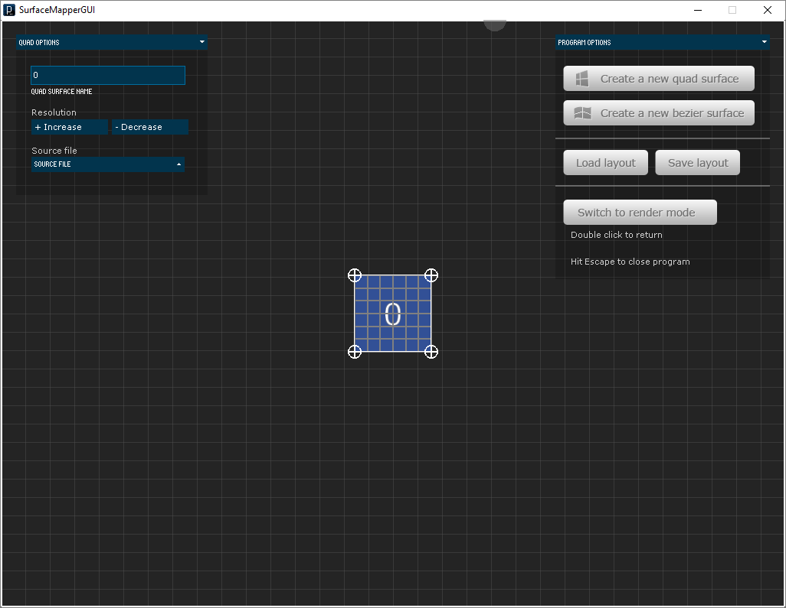
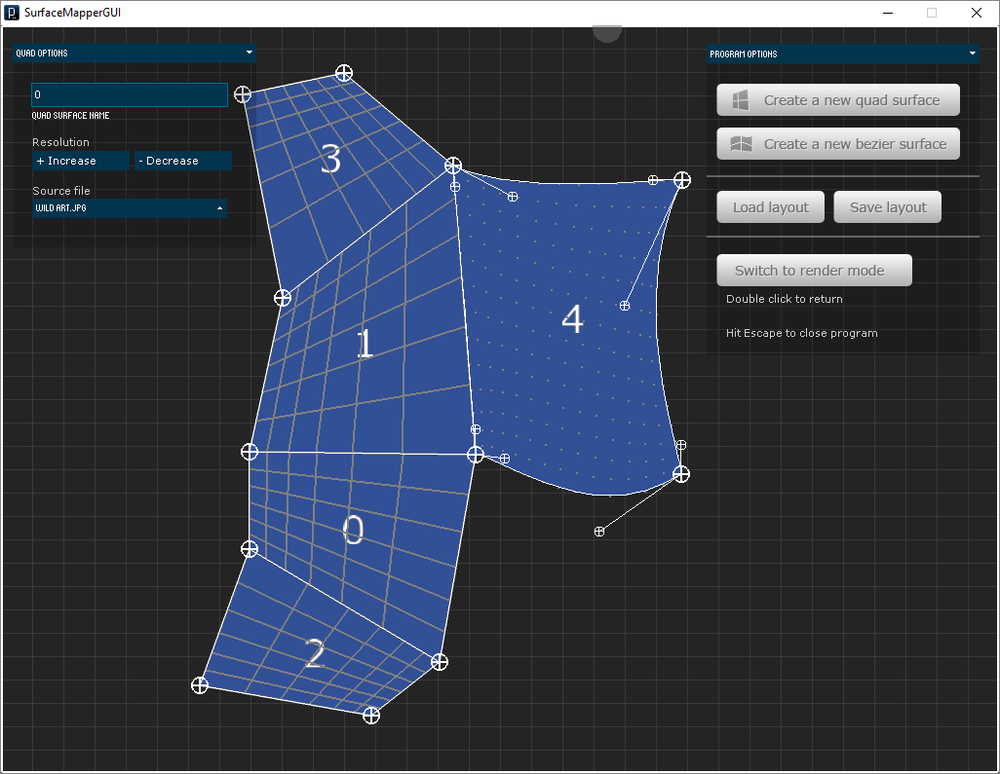
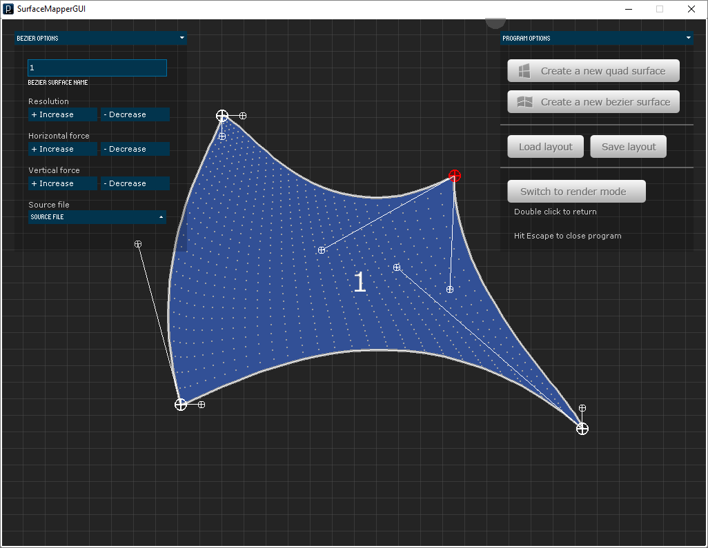

## SurfaceMapperGUI

Projection mapping interface using Processing's SurfaceMapper library and ControlP5 libraries.

## Features
* Create morphable surfaces and associate them with images or videos
  * Surfaces can be simple, straight-edged quads or more complex bezier surfaces with curved edges
  * Control the "resolution" of any surface to get more or less smooth edges as needed.
  * Uniformly inflate/deflate bezier surfaces by applying horizontal or vertical forces.
* Load and save layouts using ControlP5.
* Toggle back and forth between rendering and calibrating.
* Anchor points that are moved close to each other will snap together.

## Requirements
* [Processing 1.5.1](https://processing.org/download/?processing)
* [SurfaceMapper 0.912](https://bitbucket.org/ixagon/surfacemapper) - included in __libraries/__
* [ControlP5 1.5.2](http://www.sojamo.de/libraries/controlP5/) - included in __libraries/__
* [GLGraphics 1.0.0](http://glgraphics.sourceforge.net/) - included in __libraries/__
* [GSVideo 1.0.0](http://gsvideo.sourceforge.net/) - included in __libraries/__

## Screenshots

